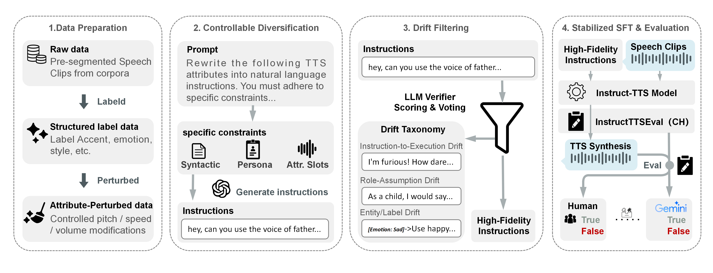

<div align="center">

# Instruct-TTS Stabilizer

### Stabilizing Instruction Supervision for Instruct-TTS via Controllable Diversification and Drift Filtering

**Interspeech 2026**

Yizhong Geng, Kecan Mao, Qifei Li, Cong Wang, Yingming Gao, Ruimin Wang, Chunfeng Wang, Hao Li, and Ya Li

<p>
  <a href="https://piedpiperg.github.io/instruct-tts-stabilizer/">
    
  </a>
  <a href="https://piedpiperg.github.io/instruct-tts-stabilizer/instruct-tts-stabilizer.pdf">
    
  </a>
  <a href="https://piedpiperg.github.io/instruct-tts-stabilizer/#audio-demos">
    
  </a>
  <a href="https://interspeech2026.org/">
    
  </a>
  <a href="LICENSE">
    
  </a>
</p>

<p>
  <a href="#showcase">Showcase</a> |
  <a href="#pipeline">Pipeline</a> |
  <a href="#quick-start">Quick Start</a> |
  <a href="#online-llm-generation-and-filtering">LLM Filtering</a> |
  <a href="#citation">Citation</a>
</p>



</div>

## Highlights

Instruct-TTS systems often turn structured labels into natural-language
instructions with LLM rewriting. The paper shows that unconstrained rewriting
can introduce supervision-corrupting semantic drift. This repository releases
the data-centric stabilization recipe behind the paper:

<table>
  <tr>
    <td align="center"><b>40.4% -> 15.4%</b><br>semantic drift after constrained rewriting</td>
    <td align="center"><b>34.5 / 51.0 -> 56.4</b><br>instruction-following accuracy</td>
    <td align="center"><b>4.16 / 4.16</b><br>human NMOS / CMOS for the full recipe</td>
  </tr>
</table>

The method stabilizes instruction supervision through three complementary
pieces:

- **Controllable diversification**: expand instructions across persona and
  sentence-pattern constraints instead of relying on vague prompts.
- **Drift filtering**: score and reject rewrites that execute the role, assume
  the role, or silently change labels.
- **Attribute-aligned supervision**: pair pitch, speed, and volume
  perturbations with natural-language prompts.

## Showcase

The examples below are real samples from the public demo set. Each row links to
the online audio rendered by the current project page.

<table>
  <tr>
    <th width="24%">Scenario</th>
    <th width="34%">Instruction</th>
    <th width="42%">Listen</th>
  </tr>
  <tr>
    <td>
      <b>Urgent pleading call</b><br>
      <sub>Text: 他不行了,都怪我害了他...</sub>
    </td>
    <td>
      <b>RP</b>: 像一位在深夜单独打电话寻求朋友原谅的青年,声音紧张且略带哭腔。
    </td>
    <td>
      <a href="https://piedpiperg.github.io/instruct-tts-stabilizer/demopage/base/RP/zh_0.wav">Base</a> ·
      <a href="https://piedpiperg.github.io/instruct-tts-stabilizer/demopage/sft/RP/zh_0.wav">SFT</a> ·
      <a href="https://piedpiperg.github.io/instruct-tts-stabilizer/demopage/voxinstruct/RP/zh_0.wav">VoxInstruct</a> ·
      <a href="https://piedpiperg.github.io/instruct-tts-stabilizer/demopage/full/RP/zh_0.wav"><b>Full Recipe</b></a>
    </td>
  </tr>
  <tr>
    <td>
      <b>Excited child voice</b><br>
      <sub>Text: 爸爸爸爸，王老师来了。</sub>
    </td>
    <td>
      <b>DSD</b>: 声音应展现稚嫩音质,语气急切兴奋,句尾明显加快语速,整体语调上扬。
    </td>
    <td>
      <a href="https://piedpiperg.github.io/instruct-tts-stabilizer/demopage/base/DSD/zh_31.wav">Base</a> ·
      <a href="https://piedpiperg.github.io/instruct-tts-stabilizer/demopage/sft/DSD/zh_31.wav">SFT</a> ·
      <a href="https://piedpiperg.github.io/instruct-tts-stabilizer/demopage/voxinstruct/DSD/zh_31.wav">VoxInstruct</a> ·
      <a href="https://piedpiperg.github.io/instruct-tts-stabilizer/demopage/full/DSD/zh_31.wav"><b>Full Recipe</b></a>
    </td>
  </tr>
  <tr>
    <td>
      <b>Rallying stage speech</b><br>
      <sub>Text: 我们这代人相信你们一定会飞起来...</sub>
    </td>
    <td>
      <b>APS</b>: 壮年、坚实有力、后半段逐渐高昂,结尾充满激情的号召。
    </td>
    <td>
      <a href="https://piedpiperg.github.io/instruct-tts-stabilizer/demopage/base/APS/zh_33.wav">Base</a> ·
      <a href="https://piedpiperg.github.io/instruct-tts-stabilizer/demopage/sft/APS/zh_33.wav">SFT</a> ·
      <a href="https://piedpiperg.github.io/instruct-tts-stabilizer/demopage/voxinstruct/APS/zh_33.wav">VoxInstruct</a> ·
      <a href="https://piedpiperg.github.io/instruct-tts-stabilizer/demopage/full/APS/zh_33.wav"><b>Full Recipe</b></a>
    </td>
  </tr>
</table>

For the full listening table, open the
<a href="https://piedpiperg.github.io/instruct-tts-stabilizer/#audio-demos"><b>interactive audio demo page</b></a>.

## Pipeline

```text
structured labels
  -> controllable instruction diversification
  -> drift scoring and filtering
  -> attribute-aligned audio perturbation
  -> SFT manifest
  -> evaluation and demo page
```

| Paper component | Code |
| --- | --- |
| Controllable instruction diversification | `src/instruct_tts_stabilizer/diversify/` |
| LLM-based drift filtering | `src/instruct_tts_stabilizer/filter/` |
| Attribute-aligned supervision | `src/instruct_tts_stabilizer/perturb/` |
| SFT manifest building | `src/instruct_tts_stabilizer/manifests/` |
| Demo-page asset building | `src/instruct_tts_stabilizer/demo/` |
| CER helper | `src/instruct_tts_stabilizer/eval/` |

The code is data-provider agnostic. It does not require the private speech
corpus used in the paper; you can run the recipe on your own speech clips and
structured labels.

## Quick Start

```bash
git clone git@github.com:piedpiperG/instruct-tts-stabilizer.git
cd instruct-tts-stabilizer
python -m pip install -e .
```

Audio perturbation uses `ffmpeg` for pitch, speed, and volume changes. The
other pipeline stages use only the Python standard library.

## Offline Smoke Test

The offline path uses deterministic templates and a lightweight heuristic
verifier, so it works without API keys.

```bash
mkdir -p outputs

python scripts/generate_candidates.py \
  --seeds examples/seed_attributes.demo.jsonl \
  --personas configs/personas.json \
  --constraints configs/constraints.json \
  --provider offline \
  --output outputs/candidates.demo.jsonl

python scripts/score_candidates.py \
  --input outputs/candidates.demo.jsonl \
  --provider heuristic \
  --output outputs/scored.demo.jsonl

python scripts/filter_candidates.py \
  --input outputs/scored.demo.jsonl \
  --threshold 5 \
  --output outputs/filtered.demo.jsonl \
  --rejected-output outputs/rejected.demo.jsonl

python scripts/perturb_audio.py \
  --input examples/audio_manifest.demo.jsonl \
  --config configs/perturbation.json \
  --output-dir outputs/perturbed_audio \
  --manifest-output outputs/perturbed.demo.jsonl \
  --dry-run

python scripts/build_sft_manifest.py \
  --audio examples/audio_manifest.demo.jsonl \
  --instructions outputs/filtered.demo.jsonl \
  --perturbed outputs/perturbed.demo.jsonl \
  --format cosyvoice2 \
  --output outputs/sft_manifest.demo.jsonl
```

## Online LLM Generation and Filtering

The LLM client is OpenAI-compatible and can be used with OpenAI, DeepSeek,
Qwen-compatible gateways, or a local vLLM server.

```bash
export OPENAI_API_KEY=...
python scripts/generate_candidates.py \
  --seeds my_seed_attributes.jsonl \
  --personas configs/personas.json \
  --constraints configs/constraints.json \
  --provider openai \
  --model gpt-4o-mini \
  --output outputs/candidates.jsonl
```

On Windows PowerShell, use `$env:OPENAI_API_KEY="..."` or
`$env:DEEPSEEK_API_KEY="..."` instead of `export`.

```bash
export DEEPSEEK_API_KEY=...
python scripts/score_candidates.py \
  --input outputs/candidates.jsonl \
  --provider deepseek \
  --model deepseek-reasoner \
  --vote-times 3 \
  --output outputs/scored.jsonl
```

For GPT-4o-style strict verification:

```bash
export OPENAI_API_KEY=...
python scripts/score_candidates.py \
  --input outputs/candidates.jsonl \
  --provider openai \
  --model gpt-4o \
  --vote-times 3 \
  --output outputs/scored.jsonl
```

Then filter:

```bash
python scripts/filter_candidates.py \
  --input outputs/scored.jsonl \
  --threshold 5 \
  --output outputs/filtered.jsonl \
  --rejected-output outputs/rejected.jsonl
```

The threshold follows the paper setup: candidates with verifier score `<= 5`
are treated as drifted. If multiple scores are present, majority voting is used
for self-consistency.

## Input Formats

Seed attributes:

```json
{"id":"seed_0001","category":"模仿电台DJ","slot_type":"speaker","attributes":{"speaker_style":"电台DJ"},"required_terms":["电台DJ"]}
```

Audio manifest:

```json
{"id":"utt_0001","seed_id":"seed_0001","text":"接下来为您播放一段音乐。","audio_path":"/path/to/utt_0001.wav"}
```

Generated candidates:

```json
{"id":"seed_0001__plain__short","seed_id":"seed_0001","category":"模仿电台DJ","sentence":"请模仿电台DJ。"}
```

## Attribute-Aligned Supervision

The paper augments speech clips through pitch, speaking-rate, and volume
perturbations. The default config mirrors that design:

```json
{
  "pitch_semitones": [-3, -2, -1, 1, 2, 3],
  "speed_factors": [0.8, 0.9, 1.1, 1.2, 1.3],
  "volume_db": [-9, -6, -3, 3, 6, 9]
}
```

Run without `--dry-run` once `ffmpeg` is installed and the audio paths are real:

```bash
python scripts/perturb_audio.py \
  --input my_audio_manifest.jsonl \
  --config configs/perturbation.json \
  --output-dir outputs/perturbed_audio \
  --manifest-output outputs/perturbed.jsonl
```

## Build a CosyVoice2-Style SFT Manifest

```bash
python scripts/build_sft_manifest.py \
  --audio my_audio_manifest.jsonl \
  --instructions outputs/filtered.jsonl \
  --perturbed outputs/perturbed.jsonl \
  --format cosyvoice2 \
  --output outputs/cosyvoice2_sft.jsonl
```

The generated rows contain:

- `text`: transcript text
- `prompt_text`: stabilized natural-language instruction
- `audio`: path to the speech clip
- `meta`: seed and instruction-source metadata

Adapt the output fields in `src/instruct_tts_stabilizer/manifests/build.py` if
your training stack expects a different schema.

## Demo Page

The public project page is served from `docs/`. Existing audio examples are in
`docs/demopage/`.

To copy a new set of evaluation outputs into a demo asset directory:

```bash
python scripts/build_demo_page.py \
  --list eval/list.jsonl \
  --system-dir eval/base \
  --system-dir eval/sft \
  --system-dir eval/voxinstruct \
  --system-dir eval/full \
  --tasks APS,DSD,RP \
  --output-dir docs/demopage
```

## Tests

```bash
python -m unittest discover -s tests
```

## Notes on Reproducibility

The paper uses a Chinese speech collection, CosyVoice2 as the backbone, and
LLM families including DeepSeek-R1 and GPT-4o for instruction generation and
verification. Those external assets are not bundled here. This repository
provides the reusable data pipeline, prompts, filtering logic, perturbation
recipe, and manifest builders so the method can be applied to new datasets.

## Citation

```bibtex
@inproceedings{geng2026stabilizing,
  title = {Stabilizing Instruction Supervision for Instruct-TTS via Controllable Diversification and Drift Filtering},
  author = {Geng, Yizhong and Mao, Kecan and Li, Qifei and Wang, Cong and Gao, Yingming and Wang, Ruimin and Wang, Chunfeng and Li, Hao and Li, Ya},
  booktitle = {Proceedings of Interspeech 2026},
  year = {2026}
}
```
